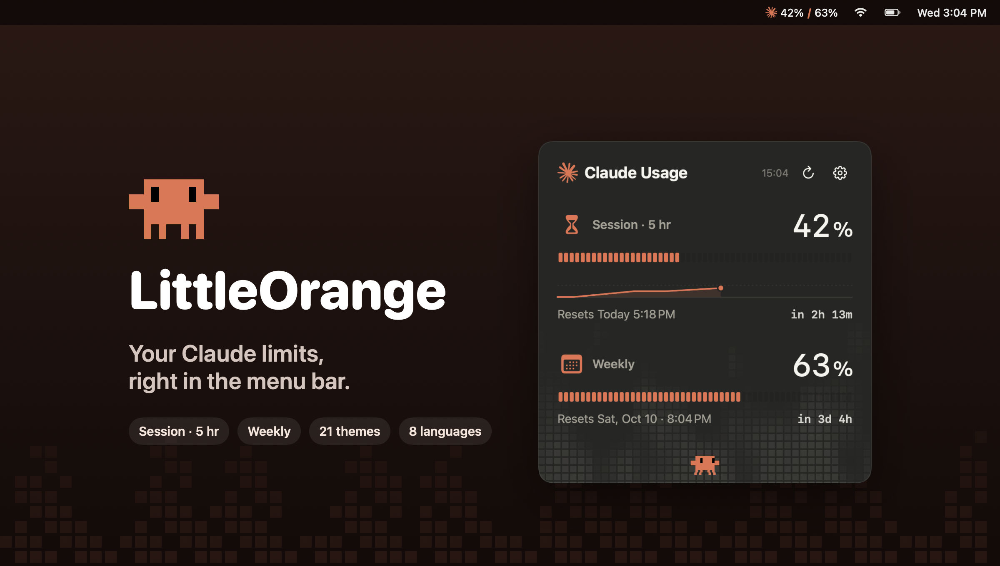
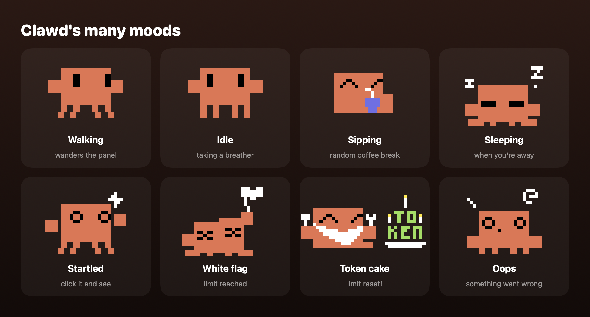
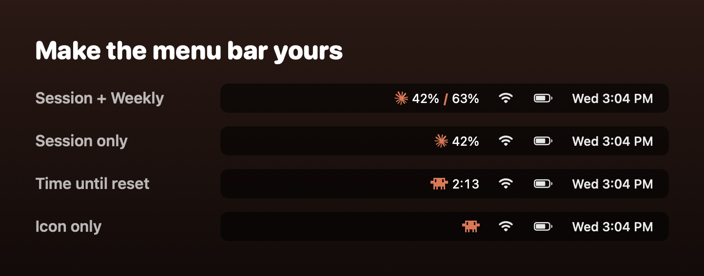
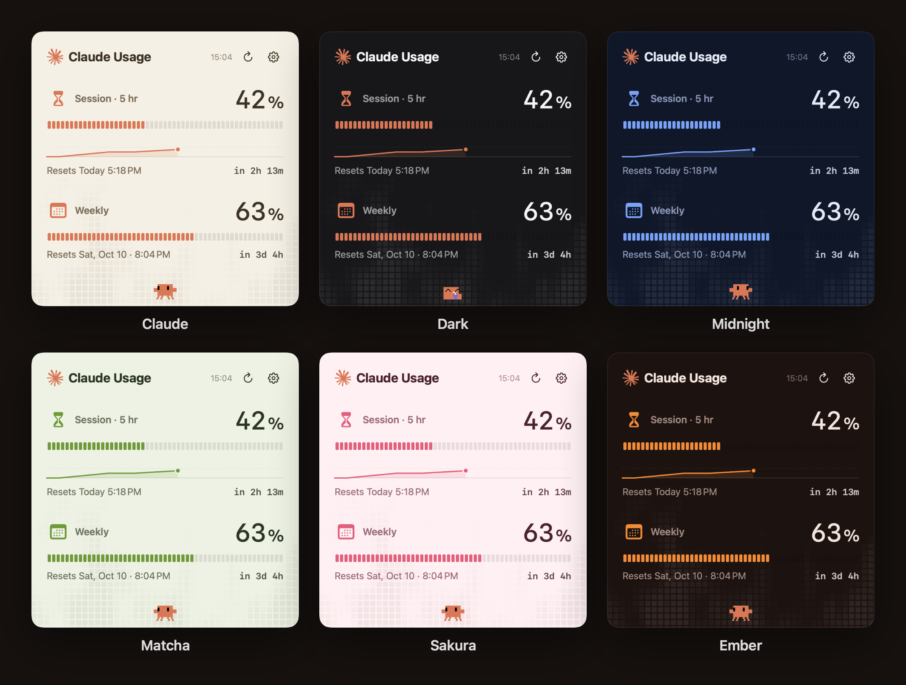
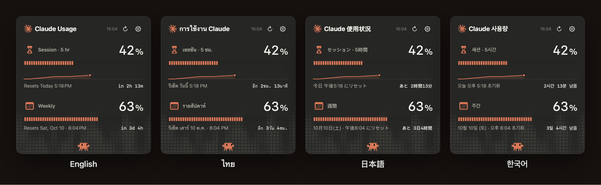

  

  
  
  

<b>Stop finding out you've hit your Claude limit the hard way.</b> 
LittleOrange keeps your 5-hour session and weekly usage one glance away, with a tiny pixel friend keeping you company.

---

## ✨ Why you'll like it

| | |
|---|---|
| ⏳ **Both limits at a glance** | Session and weekly usage live right in your menu bar. |
| 🕐 **Know exactly when you're back** | Reset times down to the minute, plus how long is left. |
| 📈 **See your pace** | A little chart shows how fast this session is filling up. |
| 🔥 **Feels alive** | The panel reacts to how hard you're working. You'll see. |
| 🎨 **21 themes** | From quiet Paper to deep Midnight. Pick your vibe. |
| 🌏 **8 languages** | English, ไทย, 日本語, 简体中文, 한국어, Español, Português, Deutsch. |
| 🪶 **Featherweight** | 0% CPU when the panel is closed. Starts at login if you want it to. |

## 🧡 Meet Clawd

A pixel-perfect Clawd lives at the bottom of the panel. It wanders, naps, takes coffee breaks, and has opinions about your usage.

## 🧭 Make the menu bar yours

Show both limits, just the session, a countdown to reset, or only the icon. Pick the Claude spark or Clawd.

## 🎨 21 themes

## 🌏 Speaks your language

## 📦 Install

> **Requirements:** macOS 13 Ventura or later · [Claude Code](https://claude.com/claude-code) signed in with your Claude account (run `claude`, then `/login`)

1. Download **`LittleOrange.dmg`** from the [latest release](../../releases/latest).
2. Open it and drag **LittleOrange** into **Applications**.
3. Open LittleOrange. macOS will block it the first time because the app isn't notarized yet.
   Go to **System Settings → Privacy & Security**, scroll down and click **Open Anyway**.
4. If macOS asks whether LittleOrange can use your Keychain, click **Always Allow**.
5. Look up at your menu bar. 🍊

## ❓ FAQ

<b>Do I need Claude Code?</b>

Yes. LittleOrange reads the sign-in that Claude Code saves on your Mac. The Claude desktop app or claude.ai alone isn't enough, and API-key users don't have session or weekly limits to show.

<b>Does refreshing use up my limits?</b>

No. LittleOrange only asks how much you've used. It never sends anything to Claude, so it doesn't count against your limits.

<b>It says my sign-in expired.</b>

Open `claude` once in Terminal. Claude Code renews the sign-in, and LittleOrange picks it up on the next refresh.

<b>Why does macOS warn me when I open it?</b>

LittleOrange is a free side project and isn't notarized by Apple yet, so macOS asks you to confirm the first time. Use **Open Anyway** in Privacy & Security.

## 🔒 Privacy

LittleOrange reads your Claude Code sign-in from the Keychain and talks only to Claude's usage endpoint.
Nothing else leaves your Mac. No accounts, no analytics, no tracking.

## ⚠️ Good to know

- The usage endpoint isn't a public API, so a future Claude update could break things for a while.
- LittleOrange is a free, unofficial app made by a fan. It isn't affiliated with or endorsed by Anthropic.

Made with 🍊 by <a href="https://github.com/northnnnnn">northnnnnn</a>

